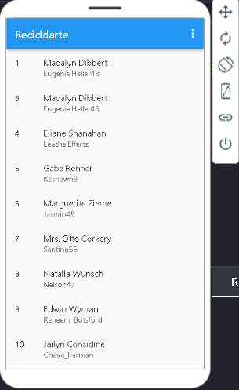
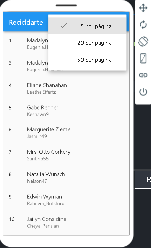
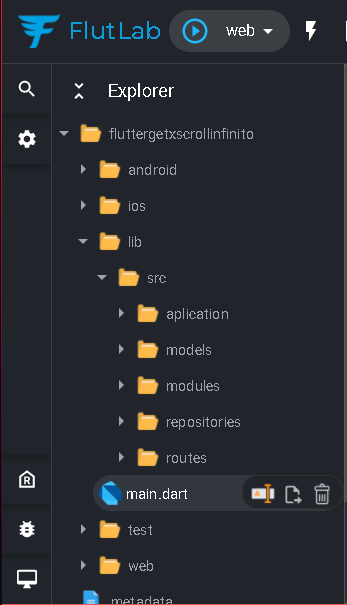

# flutter_getx_scroll_infinito

Este projeto é um exemplo de como fazer uma requisição a API e listar os registros retornados de acordo com a quantidade de itens selecionada.

## Getting Started

- [Lab: Escreva seu primeiro aplicativo Flutter - oficial](https://flutter.dev/docs/get-started/codelab)
- [Amostras úteis de Flutter - oficial](https://flutter.dev/docs/cookbook)
- [Documentação online](https://flutter.dev/docs)

- [Plataforma online que utilizo para codar: FlutLab.io](https://flutlab.io)
- [Documentação do Getx](https://pub.dev/packages/get)
- [Créditos ao autor do projeto original: Rodrigo Silva Rahman de Almeida](https://github.com/rodrigorahman)
- [Projeto Original](https://github.com/rodrigorahman/infinite_scroll_getx)

